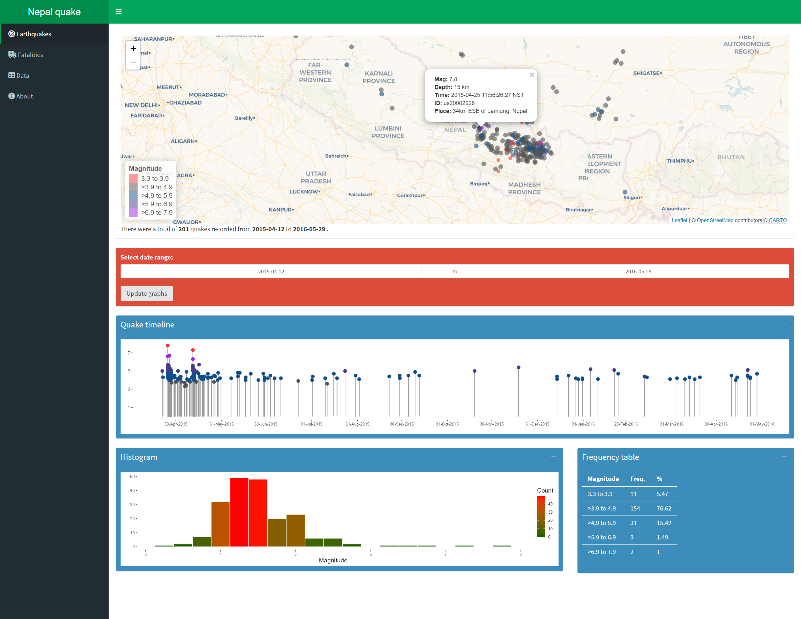
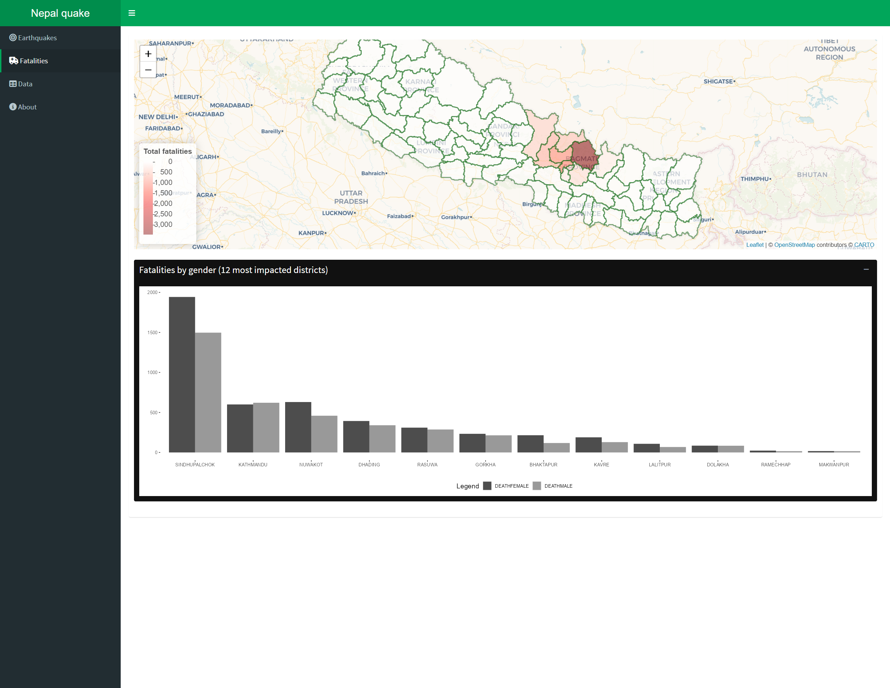

# About Nepal Quake dashboard

This is a simple implementation of Shiny dashboard to explore the [April 2015 Nepal earthquake](http://en.wikipedia.org/wiki/April_2015_Nepal_earthquake) data. The earthquake data used here is NOT real-time. The records were downloaded from USGS website (csv format) and placed in the data folder. To filter the quakes in the vicinity of Nepal, only the quakes within the bounding box of Nepal map are used.

You can try the app live at: [https://asheshwor.shinyapps.io/np-quake](https://asheshwor.shinyapps.io/np-quake).

Alternatively, you can also run the app locally in RStudio by using the following code.

```R
## Install missing packages
packagesRequired <- c("shinydashboard", "leaflet", "dplyr",
                      "tidyverse", "scales", "ggplot2",
                      "data.table", "rgdal", "jsonlite",
                      "shiny")
packagesToInstall <- packagesRequired[!(packagesRequired %in%
                                          installed.packages()[,"Package"])]
if(length(packagesToInstall)) install.packages(packagesToInstall)
## Run app from Github repo
shiny::runGitHub('asheshwor/np-quake')
````


<small>Screenshot of app's main page</small>


<small>Screenshot of app's fatalities page</small>

## Disclaimer

I am not an earthquake expert. This is not at an attempt to predict aftershock events.

## R packages used

*   shinydashboard
*   leaflet
*   dplyr
*   scales
*   ggplot2
*   ~~reshape2~~
*   tidyverse
*   data.table
*   rgdal
*   jsonlite

## Source code

Full source code is available from the following github repo: [https://github.com/asheshwor/np-quake](https://github.com/asheshwor/np-quake)

## Attribution

**Earthquake data:** This app uses earthquake data from USGS [http://earthquake.usgs.gov/earthquakes/feed/v1.0/csv.php](http://earthquake.usgs.gov/earthquakes/feed/v1.0/csv.php)  
 **Fatalities, injuries and damage data:** Ministry of Home Affairs (MoHA)/National Emergency Operation Center (NEOC) official figures for casualties and damages [5 June update] [MoHA/NEOC official figures Google spreadsheet link](https://docs.google.com/spreadsheets/d/1MCsMtcfN8jwGg4qdzYZCKyxpYp8cdqRSrEpF1WpR6ZE/edit#gid=1367273225)  
 **Nepal districts map geojson file:** Shared under MIT license by Saugat Acharya [https://github.com/mesaugat/geoJSON-Nepal](https://github.com/mesaugat/geoJSON-Nepal)  
 **Map data:** The maps are generated using [leaflet for R](https://rstudio.github.io/leaflet/). Map tiles from [Mapbox](https://www.mapbox.com/). Mapbox uses map data from [Open Street Maps](http://www.openstreetmap.org/).
